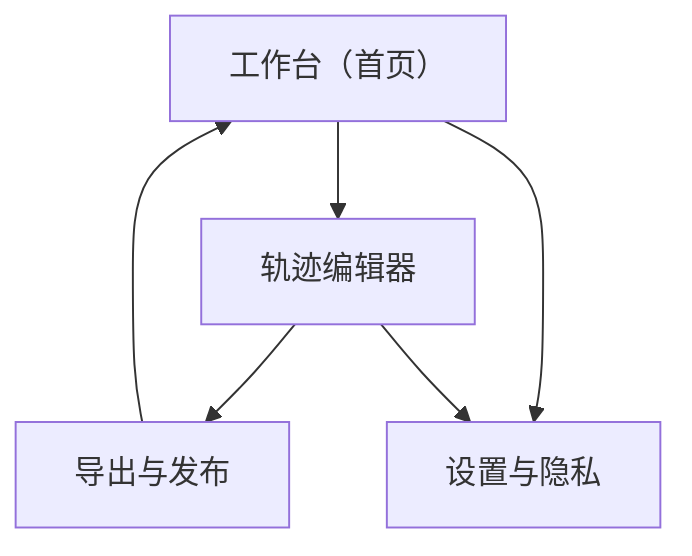

## 1. Product Overview
一款“本地优先”的轨迹可视化工具：将你的运动轨迹文件在本地解析并渲染为高质量 3D 海报与动画。
面向跑步/骑行/徒步等用户与内容创作者，在不上传原始轨迹数据的前提下快速产出可分享作品。

## 2. Core Features

### 2.1 Feature Module
本产品由以下必要页面组成：
1. **工作台（首页）**：导入轨迹、轨迹列表、基础预览、进入编辑。
2. **轨迹编辑器**：3D 预览与相机、样式与配色、文本与信息层、时间与速度映射。
3. **导出与发布**：导出海报/动画、分辨率与格式、作品打包与本地保存。
4. **设置与隐私**：本地存储管理、隐私声明与开关、性能与渲染选项。

### 2.2 Page Details
| Page Name | Module Name | Feature description |
|---|---|---|
| 工作台（首页） | 轨迹文件导入 | 选择本地文件（如 GPX/FIT/TCX），展示校验结果与基本统计（距离/爬升/时长）。 |
| 工作台（首页） | 本地解析管线 | 在本机完成解码与规范化（坐标/时间/海拔/速度），不向网络发送原始轨迹。 |
| 工作台（首页） | 轨迹项目列表 | 列出最近项目、搜索/筛选、显示封面缩略图与更新时间。 |
| 工作台（首页） | 快速预览 | 以 2D/简化 3D 预览轨迹形态，支持一键进入编辑器。 |
| 工作台（首页） | 自动生成初稿 | 基于默认模板生成第一版海报构图（配色/标题/数据卡片）。 |
| 工作台（首页） | 本地项目存储 | 将解析结果与编辑配置保存到本地（可恢复、可继续编辑）。 |
| 轨迹编辑器 | 3D 轨迹渲染 | 以 3D 曲线/带状轨迹渲染轨迹，支持抗锯齿、阴影/雾化等视觉效果。 |
| 轨迹编辑器 | 坐标与姿态处理 | 支持轨迹居中、缩放、旋转、地形平面/基座高度与倾角设置。 |
| 轨迹编辑器 | 相机与灯光 | 提供轨道相机、预设视角（俯视/等距/近景）、主光/辅光强度与色温。 |
| 轨迹编辑器 | 主题与配色 | 选择主题（深色/浅色/霓虹等）、渐变、背景纹理/纯色，实时预览。 |
| 轨迹编辑器 | 信息层排版 | 添加标题/副标题/日期/地点，支持字体、字号、对齐、间距与安全边距。 |
| 轨迹编辑器 | 数据卡片组件 | 选择并布局指标卡（距离/配速/时间/爬升等），支持图标与单位。 |
| 轨迹编辑器 | 时间/速度映射 | 将速度/心率/海拔映射到颜色或线宽（若文件包含对应数据）。 |
| 轨迹编辑器 | 动画时间线 | 选择动画类型（沿轨迹绘制/相机环绕/推拉镜头），设置时长与关键参数。 |
| 轨迹编辑器 | 模板系统 | 内置模板（海报/动画），支持一键替换模板但保留你的轨迹数据。 |
| 轨迹编辑器 | 撤销/重做 | 对样式与布局操作提供撤销/重做，避免误操作损失。 |
| 导出与发布 | 海报导出 | 导出 PNG/JPEG，支持分辨率（如 1080p/4K）与透明背景（如支持）。 |
| 导出与发布 | 动画导出 | 导出 MP4/WebM/GIF（按实现优先级），支持帧率、码率与时长。 |
| 导出与发布 | 作品打包保存 | 将项目配置+导出文件打包到本地目录，便于备份与迁移。 |
| 设置与隐私 | 隐私与网络策略 | 提供“离线模式/禁用外网请求”开关与隐私声明，默认不上传轨迹。 |

## 3. Core Process
**用户主流程（本地优先）**：
1) 你在工作台导入本地轨迹文件 → 应用在本地解析并生成项目。
2) 你选择一个项目进入编辑器 → 调整 3D 轨迹姿态、配色主题、信息层与数据卡片。
3) 你在导出页选择海报或动画 → 设置分辨率/格式 → 导出到本地并保存项目。
4) 你在设置中管理本地缓存与隐私开关（可一键清理）。

