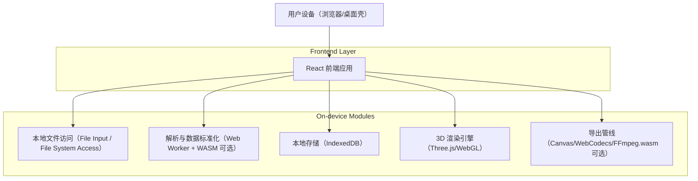
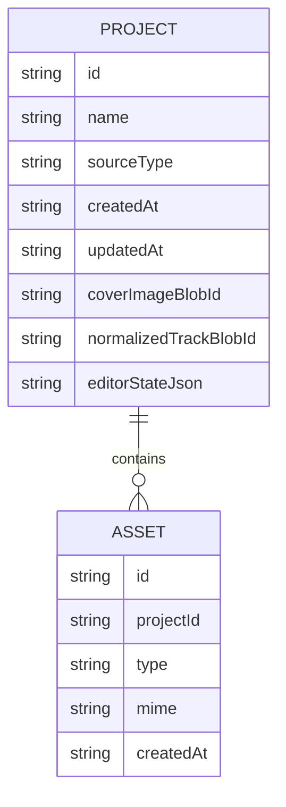

## 1.Architecture design

## 2.Technology Description
- Frontend: React@18 + TypeScript + Vite
- UI: tailwindcss@3（或同等原子化 CSS 方案）
- 3D: Three.js（WebGL 渲染）
- 本地存储: IndexedDB（推荐通过 idb 封装）
- 解析性能: Web Worker（必选）+ WASM（可选，用于 FIT/复杂解码）
- 导出: Canvas + WebCodecs（优先）/ FFmpeg.wasm（兼容兜底）
- Backend: None（默认离线/本地优先，满足“隐私不上传原始轨迹”）

## 3.Route definitions
| Route | Purpose |
|---|---|
| / | 工作台：导入、项目列表、快速预览 |
| /editor/:projectId | 轨迹编辑器：3D 预览、样式、信息层、动画时间线 |
| /export/:projectId | 导出与发布：海报/动画导出参数与本地保存 |
| /settings | 设置与隐私：网络策略、本地存储管理、性能选项 |

## 6.Data model(if applicable)
### 6.1 Data model definition
（本地数据模型，存于 IndexedDB；不依赖服务器）

### 6.2 Data Definition Language
不适用（无服务端数据库）。

---

# 目录结构与模块边界（用于后续分步实现）
> 目标：把“导入解析 / 数据模型 / 3D 渲染 / 编辑状态 / 导出”拆成可独立迭代的模块，减少耦合。

建议目录（前端单仓）：
- src/
  - app/
    - routes/（路由与页面装配；不放复杂业务）
    - providers/（全局状态/主题/错误边界）
  - pages/
    - WorkspacePage/
    - EditorPage/
    - ExportPage/
    - SettingsPage/
  - features/
    - import/
      - ui/（导入面板、格式提示、错误提示）
      - domain/（ImportJob、格式探测）
      - workers/（解析 Worker 入口与消息协议）
    - track/
      - domain/（NormalizedTrack、采样/切片、统计计算）
      - parsers/（gpx/fit/tcx 等解析适配器；统一输出 domain 模型）
    - renderer3d/
      - core/（Three.js 场景、相机、灯光、轨迹几何体）
      - materials/（主题材质与渐变）
      - presets/（视角/灯光预设）
    - editor/
      - state/（EditorState：布局、主题、相机、动画配置）
      - ui/（右侧面板、画布、时间线、属性控件）
      - commands/（撤销/重做命令）
    - export/
      - domain/（ExportSpec：尺寸、格式、帧率、码率）
      - services/（海报渲染、动画渲染、进度与取消）
  - shared/
    - ui/（通用组件：Button、Modal、Tabs、Form）
    - lib/（时间、单位换算、数学、颜色工具）
    - types/（跨模块类型）
  - storage/
    - indexeddb/（ProjectRepo、AssetRepo；只暴露接口，不泄漏实现）
  - privacy/
    - policy/（离线模式、网络拦截策略、遥测默认关闭）

模块边界规则（必须遵守）：
1) pages 只做“组装”，业务逻辑进入 features。
2) features 之间通过 shared/types 与显式接口交互，禁止相互直接 import 内部文件。
3) 解析必须在 Web Worker 中运行：主线程仅接收规范化结果与进度。
4) renderer3d 不直接读写 IndexedDB：渲染输入只接受 NormalizedTrack + RenderSpec。
5) export 不直接依赖 editor UI：只依赖 EditorState 与 renderer3d 的可复用渲染接口。
6) privacy 模块对外提供单一开关：默认“禁止外发原始轨迹/关闭遥测”。
