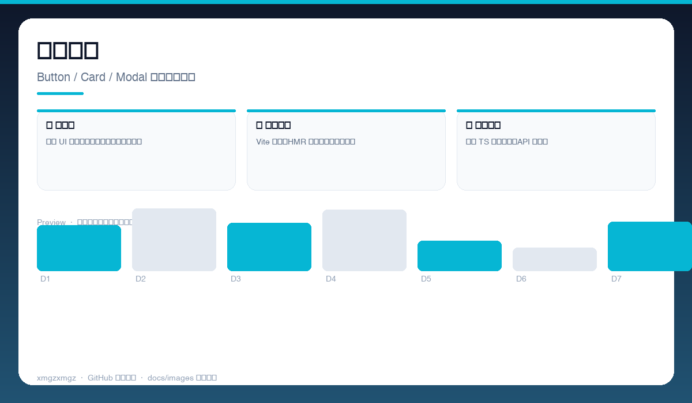
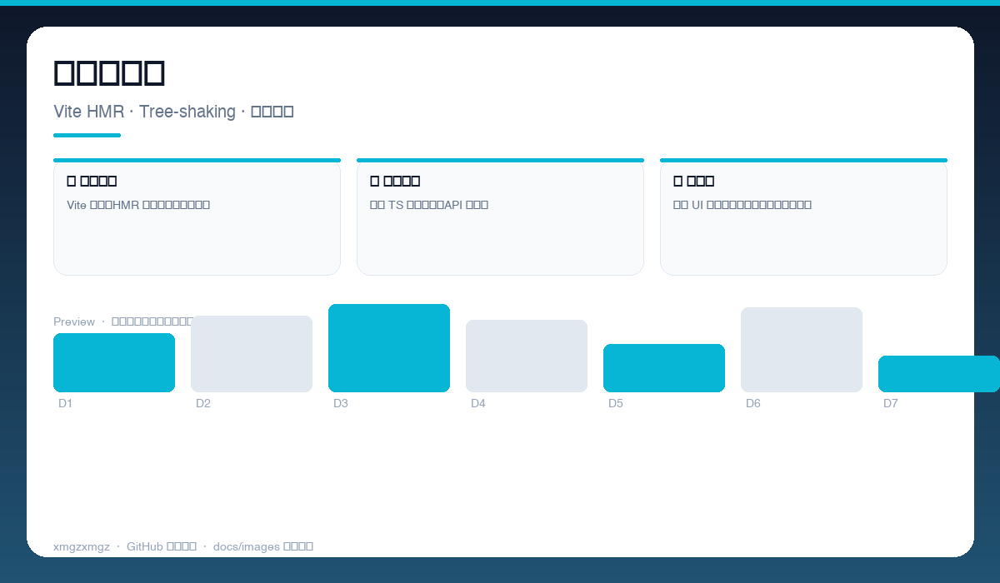
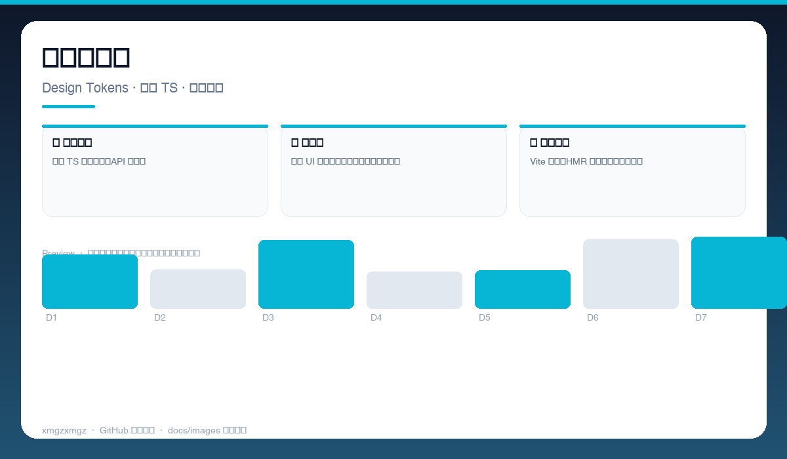

# ⚡ Flux — Flux

> 类型安全的前端实验室 — 轻量构建 + 精选组件，开箱即快。

[](https://github.com/xmgzxmgz/Flux)
[](https://github.com/xmgzxmgz/Flux/releases)
[](LICENSE)
[](https://github.com/xmgzxmgz/Flux/actions/workflows/release.yml)

---

## ✨ 功能一览

| 模块 | 能力 | 状态 |
|------|------|------|
| 🧩 组件集 | 常用 UI 组件类型完备，按需引入零冗余 | ✅ |
| ⚡ 极速构建 | Vite 驱动，HMR 秒开，打包体积精简 | ✅ |
| 🔒 类型安全 | 全量 TS 严格模式，API 即文档 | ✅ |

---

## 📸 功能预览

> 以下为自动生成的示意预览（无需本地部署截图），展示核心功能形态。

| 总览 | 细节 | 流程 |
|------|------|------|
|  |  |  |
| 组件预览 · Button / Card / Modal 类型安全演示 | 构建流水线 · Vite HMR · Tree-shaking · 体积分析 | 主题与类型 · Design Tokens · 严格 TS · 自动文档 |

<details>
<summary>查看大图</summary>


</details>

---

## 🚀 快速开始

```bash
pnpm install
pnpm dev      # 本地预览
pnpm build    # 生产构建
```

---

## 🛠 技术栈

TypeScript · Vite · React · ESLint · pnpm

---

## 🗂️ 目录结构（节选）

```
Flux/
├── docs/images/        # 本 README 的三张自动生成预览图
├── .github/workflows/  # Auto Release 自动发版
├── README.md
└── ...                 # 源码与配置
```

---

## 📦 Releases

本仓库已启用 **Auto Release**（`.github/workflows/release.yml`）：

- 推送 `v*` tag 自动发版：`git tag v0.2.0 && git push origin v0.2.0`
- 手动触发：`gh workflow run "Auto Release" -f version=v0.2.0`（留空则自动 patch +1）
- 变更说明自动生成（`--generate-notes`）

前往 [Releases](https://github.com/xmgzxmgz/Flux/releases) 查看。

---

## 🙏 相关项目

- [workbuddy-account-hub](https://github.com/xmgzxmgz/workbuddy-account-hub) — WorkBuddy 账户中枢（本 README 的样板）
- 更多见 [xmgzxmgz 主页](https://github.com/xmgzxmgz)

---

## 许可

MIT
